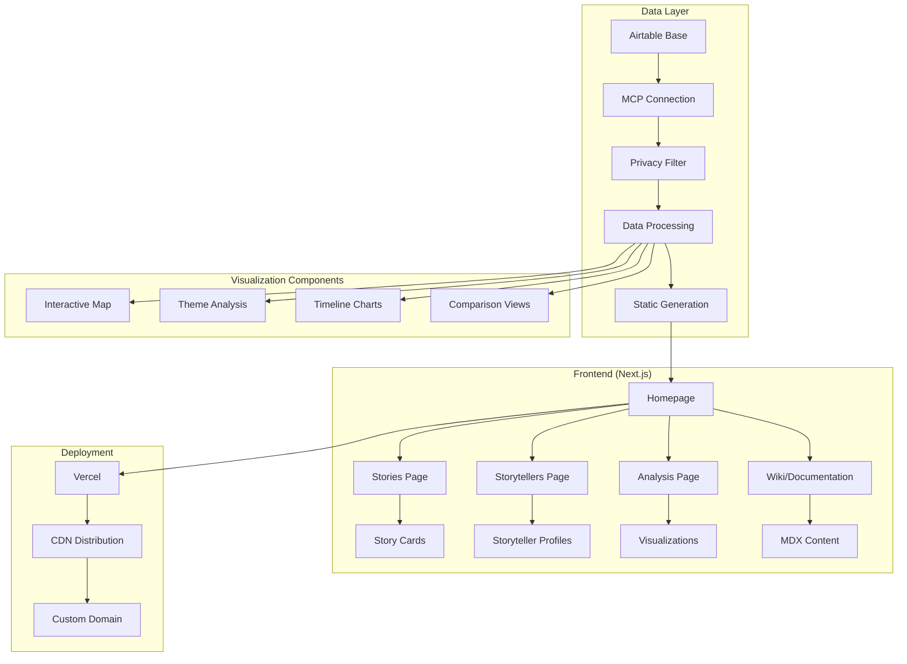
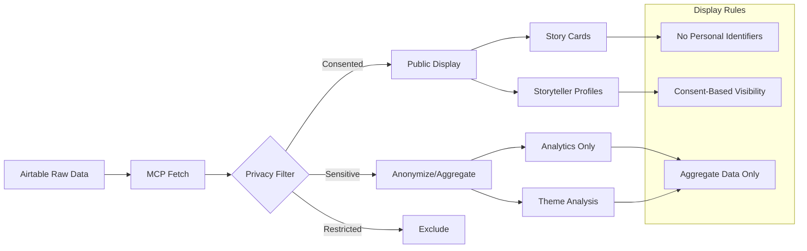
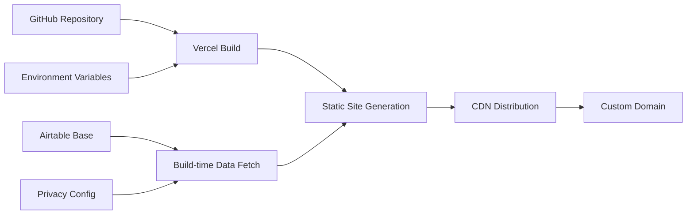

# Empathy Ledger Showcase Site - Technical Architecture Plan

## Project Overview

Building a privacy-first showcase site to demonstrate the impact of 102 ethical stories collected through Orange Sky's Empathy Ledger project, with deployment in 2 weeks maximum.

## Technical Architecture



## Privacy-First Data Architecture



## Site Structure

### 1. Homepage
Purpose: Immediate impact and navigation
- Hero: "102 Stories. 8 Cities. One Mission."
- Key metrics visualization (animated counters)
- Interactive map showing story locations
- Navigation cards to main sections
- Featured story carousel

### 2. Stories Page
Purpose: Browse and explore individual stories
- Grid/list view toggle
- Filters:
  - Location (city/shift)
  - Role (friend/volunteer)
  - Themes
  - Date collected
- Story cards showing:
  - Title/excerpt
  - Location
  - Themes
  - Privacy-safe preview

### 3. Storytellers Page
Purpose: Honor the people behind the stories
- Respectful directory (only public consent)
- Filter by:
  - Location
  - Role
  - Shift association
- Storyteller profiles showing:
  - Number of stories
  - Themes they discuss
  - Their journey (if shared)

### 4. Analysis Page
Purpose: Show the power of collective storytelling
Sections:
- Theme Analysis
  - Word clouds
  - Theme frequency charts
  - Theme connections network
  
- Geographic Insights
  - Stories per location
  - Regional theme differences
  - Service coverage map
  
- Role Comparison
  - Friend vs volunteer perspectives
  - Common ground visualization
  - Unique insights by role
  
- Impact Metrics
  - Collection timeline
  - Engagement patterns
  - Growth visualization

### 5. Wiki/Documentation
Purpose: Enable replication and share learnings
Sections:
- Project Overview
  - Timeline
  - Methodology
  - Ethical framework
  
- How-To Guides
  - Airtable setup guide
  - Content consent app tutorial
  - Descript video workflow
  - Analysis techniques
  
- Reflections
  - What worked
  - Challenges faced
  - Lessons learned
  - Future recommendations
  
- Resources
  - Template downloads
  - Consent forms
  - Training materials
  - Code snippets

## Accelerated 2-Week Development Plan

### Week 1: Foundation & Core Features
**Days 1-2: Project Setup & Data Integration**
- Set up Next.js 14 with TypeScript and Tailwind CSS
- Configure Airtable MCP connection with privacy filtering
- Create base layout with Orange Sky branding (#F7931E)
- Implement data fetching utilities with error handling

**Days 3-4: Core Pages Development**
- Build responsive homepage with hero section and key metrics
- Create stories listing page with filtering capabilities
- Implement storytellers directory with privacy safeguards
- Add loading states and error boundaries

**Days 5-7: Basic Visualizations**
- Interactive location map showing story distribution
- Simple theme frequency charts
- Timeline visualization of story collection
- Basic comparison views (friend vs volunteer)

### Week 2: Advanced Features & Polish
**Days 8-10: Enhanced Visualizations**
- Theme network graph with D3.js or Recharts
- Advanced filtering and search functionality
- Story detail modals with privacy-safe previews
- Mobile-responsive design optimization

**Days 11-12: Documentation & Wiki**
- Set up MDX for wiki content
- Create comprehensive how-to guides and methodology documentation
- Add project reflections and lessons learned sections
- Build resource download section with templates and forms
- Document Airtable setup and content consent app workflows
- Create Descript video workflow documentation
- Add analysis techniques and code snippets

**Days 13-14: Testing & Deployment**
- Performance optimization and accessibility testing
- Final privacy audit and consent verification
- Deploy to Vercel with custom domain setup
- User acceptance testing and final adjustments

## Technical Implementation Details

### Data Privacy Implementation
```typescript
// Privacy filtering utility
interface PrivacyConfig {
  showPersonalDetails: boolean;
  allowAnalytics: boolean;
  displayLevel: 'full' | 'anonymous' | 'aggregate';
}

const filterStoryData = (story: RawStory): PublicStory => {
  return {
    id: story.id,
    content: story.hasContentConsent ? story.content : null,
    themes: story.themes, // Always safe to show
    location: story.location, // City level only
    date: story.date,
    storytellerProfile: story.hasProfileConsent ? {
      role: story.storytellerRole,
      journey: story.storytellerJourney
    } : null
  };
};
```

### Component Architecture
```
/components
├── layout/
│   ├── Header.tsx
│   ├── Footer.tsx
│   └── Navigation.tsx
├── visualizations/
│   ├── InteractiveMap.tsx
│   ├── ThemeNetwork.tsx
│   ├── TimelineChart.tsx
│   └── ComparisonView.tsx
├── story/
│   ├── StoryCard.tsx
│   ├── StoryGrid.tsx
│   ├── StoryFilters.tsx
│   └── StoryModal.tsx
├── storytellers/
│   ├── StorytellerCard.tsx
│   └── StorytellerDirectory.tsx
├── wiki/
│   ├── WikiLayout.tsx
│   ├── WikiNavigation.tsx
│   ├── GuideSection.tsx
│   └── ResourceDownload.tsx
└── common/
    ├── LoadingSpinner.tsx
    ├── ErrorBoundary.tsx
    └── PrivacyNotice.tsx
```

### Key Features Implementation

**1. Interactive Story Map**
- Clustered markers for story density
- Filter by themes, dates, roles
- Privacy-safe location display (city level)
- Responsive design for mobile

**2. Theme Analysis Dashboard**
- Word cloud with frequency sizing
- Theme co-occurrence network
- Sentiment analysis visualization
- Filterable by location and role

**3. Privacy-Safe Story Display**
- Consent-based content visibility
- Anonymized storyteller profiles
- Aggregate analytics only
- Clear privacy indicators

**4. Comprehensive Documentation Wiki**
- MDX-powered content management
- Searchable guide sections
- Downloadable resources and templates
- Step-by-step tutorials for replication
- Mobile-friendly navigation
- Code snippet sharing
- Video workflow documentation

## Performance & Accessibility

### Optimization Strategy
- Static site generation for fast loading
- Image optimization with Next.js Image component
- Code splitting for visualization components
- CDN distribution via Vercel

### Accessibility Compliance
- WCAG 2.1 AA compliance
- Keyboard navigation support
- Screen reader compatibility
- High contrast color schemes
- Alt text for all visualizations

## Deployment Architecture



## Risk Mitigation

**Privacy Risks:**
- Implement multiple layers of consent checking
- Regular privacy audits during development
- Clear data handling documentation
- Opt-out mechanisms for storytellers

**Technical Risks:**
- Fallback UI for failed data fetches
- Progressive enhancement for visualizations
- Mobile-first responsive design
- Performance monitoring and optimization

**Timeline Risks:**
- Prioritize MVP features first
- Parallel development of independent components
- Daily progress checkpoints
- Flexible scope adjustment if needed

## Success Metrics

**Technical:**
- Page load speed < 3 seconds
- 100% mobile responsiveness
- WCAG 2.1 AA compliance
- Zero privacy violations

**User Experience:**
- Intuitive navigation flow
- Engaging visualizations
- Clear storytelling impact
- Accessible documentation
- Comprehensive replication guides

**Documentation Goals:**
- Complete methodology documentation
- Step-by-step replication guides
- Downloadable templates and resources
- Video workflow tutorials
- Ethical framework documentation

This plan balances the comprehensive vision from your PRD with the accelerated 2-week timeline, focusing on core functionality while maintaining the privacy-first approach and visual impact that will showcase the power of ethical storytelling, plus comprehensive documentation to enable others to replicate this approach.