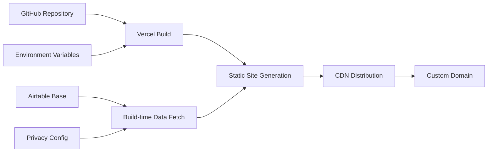

# Empathy Ledger Showcase Site: Product Requirements Document (PRD)

## 1. Introduction & Vision

### 1.1. Project Mission
To ethically collect, analyze, and amplify stories from people experiencing homelessness through Orange Sky's services, creating a platform that showcases the power of ethical storytelling and provides a replicable model for other organizations.

### 1.2. Product Vision
To build a privacy-first showcase website that demonstrates the profound impact of the 102 ethical stories collected through Orange Sky's Empathy Ledger project. The site will not only honor the storytellers but also serve as a tool to challenge stereotypes, humanize complex issues, build empathy, and drive systemic change in how organizations engage with lived experience.

### 1.3. Core Principles
This project is built on a foundation of deep respect for our storytellers, guided by the following principles from the Empathy Ledger Ethical Framework:
-   **Beneficence (Do Good):** Amplify voices respectfully to create positive social change.
-   **Non-Maleficence (Do No Harm):** Protect vulnerable storytellers and prevent re-traumatization.
-   **Justice (Fairness):** Ensure balanced representation and equitable platform access.
-   **Autonomy (Self-Determination):** Uphold narrative control with a continuous and clear consent model.

---

## 2. Goals & Success Metrics

### 2.1. Primary Goal
To design, develop, and deploy a high-impact, mobile-responsive showcase website within an accelerated **2-week timeline**.

### 2.2. Key Objectives
-   **Honor Storytellers:** Create a beautiful and respectful platform to feature the 102 collected stories and the people behind them.
-   **Demonstrate Impact:** Use compelling data visualizations to reveal the themes, patterns, and collective insights from the stories.
-   **Enable Replication:** Build a comprehensive Wiki and documentation section to serve as a how-to guide for other organizations.
-   **Uphold Privacy:** Implement a strict, privacy-first architecture based on a multi-level consent framework.

### 2.3. Success Metrics

| Category | Metric | Target |
| :--- | :--- | :--- |
| **Technical** | Page Load Speed | < 3 seconds |
| | Mobile Responsiveness | 100% compliant |
| | Accessibility | WCAG 2.1 AA |
| | Privacy | Zero violations |
| **User Experience** | Navigation | Intuitive & clear |
| | Visualizations | Engaging & insightful |
| | Documentation | Comprehensive & accessible |
| **Project** | Deployment Timeline | Within 2 weeks |

---

## 3. Features & Requirements

The website will be structured into five main sections, each with specific features and requirements.

### 3.1. Homepage
**Purpose:** Provide an immediate, high-impact introduction to the project and guide users to key sections.
-   **FR-H1: Hero Section:** Must display the tagline: "102 Stories. 8 Cities. One Mission."
-   **FR-H2: Key Metrics:** Must feature animated counters for key statistics (e.g., stories, cities, participants).
-   **FR-H3: Interactive Map:** Must display an interactive map showing the geographic distribution of stories at a city level.
-   **FR-H4: Navigation Cards:** Must include prominent cards directing users to the Stories, Storytellers, Analysis, and Wiki sections.
-   **FR-H5: Featured Stories:** Must display a rotating carousel of featured stories with consent-driven previews.

### 3.2. Stories Page
**Purpose:** Allow users to browse and explore the full collection of public stories.
-   **FR-S1: View Toggle:** Must allow users to switch between a grid and list view.
-   **FR-S2: Advanced Filtering:** Must provide filtering options based on Location (city/shift), Role (friend/volunteer), Themes, and Date Collected.
-   **FR-S3: Story Cards:** Each card must show the story's title/excerpt, location, themes, and a privacy-safe preview.

### 3.3. Storytellers Page
**Purpose:** Honor the individuals who shared their stories, respecting their consent choices at all times.
-   **FR-T1: Respectful Directory:** Must only display profiles for storytellers who have given explicit consent for public visibility.
-   **FR-T2: Profile Filtering:** Must allow filtering by Location, Role, and Shift association.
-   **FR-T3: Storyteller Profiles:** Profile pages must show the number of stories contributed, themes discussed, and their journey (if shared and consented).

### 3.4. Analysis Page
**Purpose:** Showcase the collective power and insights derived from the stories through data visualization.
-   **FR-A1: Theme Analysis:** Must include word clouds, theme frequency charts, and a theme connections network graph.
-   **FR-A2: Geographic Insights:** Must visualize stories per location and regional theme differences.
-   **FR-A3: Role Comparison:** Must provide visualizations comparing perspectives between Friends and Volunteers.
-   **FR-A4: Impact Metrics:** Must display a timeline of the collection process and engagement patterns.

### 3.5. Wiki/Documentation Page
**Purpose:** Enable replication of the Empathy Ledger methodology and share key learnings.
-   **FR-W1: MDX Content:** The entire section must be built using MDX for flexible, rich-text formatting.
-   **FR-W2: How-To Guides:** Must include comprehensive guides for Airtable setup, the content consent app, and the Descript video workflow.
-   **FR-W3: Reflections & Learnings:** Must contain sections detailing what worked, challenges faced, and lessons learned, drawing from project documentation.
-   **FR-W4: Resource Hub:** Must provide downloadable resources, including templates, consent forms, and code snippets.

---

## 4. Data & Privacy Architecture

This is the most critical aspect of the project. The architecture must be built from the ground up to protect storyteller privacy and honor their consent.

### 4.1. Data Source & Schema
-   **Data Source:** An existing Airtable base containing 102 records in the `Storytellers` table.
-   **Core Tables:** `Storytellers`, `Stories`, `Themes`, and `Shifts`.
-   **Data Flow:** Data will be fetched at build-time via an MCP connection, passed through a privacy filter, and used to statically generate the site.

### 4.2. Privacy-First Data Filtering
All data displayed on the site must be processed through a privacy filter. The implementation must adhere to the following logic:

```typescript
// Privacy filtering utility
interface PrivacyConfig {
  showPersonalDetails: boolean;
  allowAnalytics: boolean;
  displayLevel: 'full' | 'anonymous' | 'aggregate';
}

const filterStoryData = (story: RawStory): PublicStory => {
  return {
    id: story.id,
    content: story.hasContentConsent ? story.content : null,
    themes: story.themes, // Always safe to show
    location: story.location, // City level only
    date: story.date,
    storytellerProfile: story.hasProfileConsent ? {
      role: story.storytellerRole,
      journey: story.storytellerJourney
    } : null
  };
};
```

### 4.3. Consent Framework
The site must reflect the project's three-tier consent system and provide clear indicators of the privacy level for each piece of content.
-   **Consent Levels:** Internal, Public, Commercial. Only 'Public' data will be visible on the showcase site.
-   **Anonymity Options:** The system must be capable of handling Full Name, Initials, and Anonymous representation based on storyteller preference.

---

## 5. Technical Specifications

### 5.1. Tech Stack
-   **Frontend:** Next.js 14
-   **Styling:** Tailwind CSS
-   **Language:** TypeScript
-   **Deployment:** Vercel

### 5.2. Key Libraries & Integrations
-   **Data Fetching:** Airtable MCP Connector
-   **Visualizations:** Recharts or D3.js
-   **Wiki Content:** MDX

### 5.3. Deployment Architecture



---

## 6. Known Challenges & Risk Mitigation

This project inherits learnings from the Empathy Ledger pilot.

### 6.1. Identified Challenges (from Pilot)
-   **Trust Building:** Acknowledging that the quality of stories stems from a time-intensive, trust-based process.
-   **Technical Simplicity:** The MVP showcase embraces a simplified, robust tech stack (Next.js/Airtable) over initial, more complex ideas (custom platform/blockchain).
-   **Consent Clarity:** The design must use simplified language and visuals to make consent status clear to all users.

### 6.2. Risk Mitigation Plan
-   **Privacy Risks:** Implement multiple layers of consent checking in the data pipeline. Conduct regular privacy audits during development.
-   **Technical Risks:** Develop fallback UI for any failed data fetches. Use progressive enhancement for complex visualizations to ensure core content is always accessible.
-   **Timeline Risks:** Prioritize MVP features aggressively. Develop independent components in parallel. Conduct daily progress checkpoints to ensure the 2-week deadline is met.

---

## 7. Future Vision (Out of Scope for MVP)
While the 2-week sprint is focused, the architecture should not preclude future evolution. The following are explicitly out of scope for this MVP but represent the future vision:
-   **Platform Migration:** A full migration from Airtable to a PostgreSQL database with a custom backend.
-   **Blockchain Integration:** Implementation of blockchain for transparent usage tracking and automated compensation.
-   **Ethical AI:** Use of AI for advanced theme analysis, accessibility features, and translation.
-   **Full Compensation Model:** Building the infrastructure to support the documented per-use payment model.

---

## 8. Accelerated 2-Week Development Plan

This high-level plan will guide the sprint.

### Week 1: Foundation & Core Features
-   **Days 1-2:** Project Setup & Data Integration (Next.js, Tailwind, Airtable MCP).
-   **Days 3-4:** Core Pages (Homepage, Stories Page, Storytellers Page).
-   **Days 5-7:** Basic Visualizations (Interactive Map, Theme Charts, Timeline).

### Week 2: Advanced Features & Polish
-   **Days 8-10:** Enhanced Visualizations & Mobile Optimization.
-   **Days 11-12:** Documentation & Wiki Content Population.
-   **Days 13-14:** Testing, Privacy Audit, & Vercel Deployment.

This document will be the single source of truth for the development sprint. All changes must be reviewed and approved. 