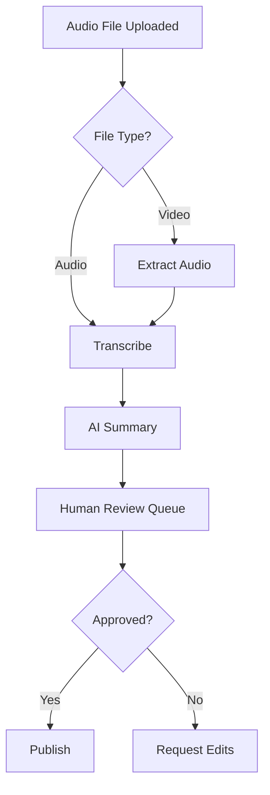

# Make.com Automation Workflows

Build powerful no-code automations for story processing, distribution, and management.

## Getting Started

### Account Setup
1. Sign up at make.com
2. Choose appropriate plan
3. Set up organization
4. Configure team access
5. Connect first apps

### Key Concepts
- **Scenarios** - Automated workflows
- **Modules** - Individual actions
- **Connections** - App authentications
- **Operations** - Usage credits
- **Webhooks** - Trigger events

## Core Story Workflows

### 1. Story Intake Automation

**Trigger:** New form submission
**Actions:**
1. Parse form data
2. Create Airtable record
3. Send to transcription
4. Notify team member
5. Start consent timer

```
[Typeform] → [Parser] → [Airtable] → [AssemblyAI] → [Slack] → [Scheduler]
```

### 2. Consent Management

**Trigger:** Calendar date reached
**Actions:**
1. Check consent status
2. Send renewal email
3. Update database
4. Log interaction
5. Schedule follow-up

```
[Schedule] → [Airtable Search] → [Email] → [Airtable Update] → [Google Sheets]
```

### 3. Content Distribution

**Trigger:** Story approved in Airtable
**Actions:**
1. Format for platform
2. Resize images
3. Post to social
4. Update website
5. Track metrics

```
[Airtable Watch] → [Text Parser] → [Cloudinary] → [Facebook] → [WordPress] → [Analytics]
```

## Module Configurations

### Airtable Integration

**Watch Records Module:**
```json
{
  "base": "appXXXXXXXXXX",
  "table": "Stories",
  "view": "Ready to Process",
  "trigger": "created_time",
  "limit": 10
}
```

**Common Operations:**
- Create record
- Update record
- Search records
- Delete record
- List records

### File Processing

**Dropbox Watch:**
- Monitor specific folder
- Filter by file type
- Move after processing
- Handle duplicates
- Error notifications

**Image Optimization:**
```
Original Image → Resize (1200x800) → Compress (85%) → Watermark → Save
```

### Communication Modules

**Email Templates:**
| Trigger | Template | Timing |
|---------|----------|--------|
| New story | Welcome | Immediate |
| Processed | Update | 24 hours |
| Published | Impact | 1 week |
| Consent | Renewal | 30 days |

**Slack Notifications:**
```javascript
{
  "channel": "#stories",
  "text": "New story from {{name}}",
  "attachments": [{
    "title": "{{story_title}}",
    "text": "{{summary}}",
    "color": "good"
  }]
}
```

## Advanced Scenarios

### Multi-Step Story Processing



**Implementation:**
1. Router module for file types
2. HTTP module for AI APIs
3. Data Store for queue
4. Filter for approval
5. Error handler for failures

### Batch Processing

**Weekly Report Generation:**
```
Every Monday 9 AM:
1. Get all stories from past week
2. Calculate metrics
3. Generate summary
4. Create PDF report
5. Email to stakeholders
```

**Configuration:**
- Schedule trigger
- Array aggregator
- Text aggregator
- PDF generator
- Email sender

## Data Transformation

### Text Operations

**Common Transformations:**
| Function | Use Case | Example |
|----------|----------|---------|
| trim() | Remove whitespace | `{{trim(text)}}` |
| substring() | Excerpt creation | `{{substring(text; 0; 150)}}...` |
| replace() | Anonymize | `{{replace(text; name; "[Name]")}}` |
| split() | Tag parsing | `{{split(tags; ",")}}` |

### JSON Handling

**Parse Response:**
```javascript
{{parseJSON(1.data)}}

// Access nested data
{{parseJSON(1.data).stories[0].title}}

// Handle arrays
{{map(parseJSON(1.data).items; "name")}}
```

### Date Formatting

**Common Formats:**
```
{{formatDate(now; "YYYY-MM-DD")}}  // 2024-03-15
{{formatDate(date; "MMM D, YYYY")}} // Mar 15, 2024
{{addDays(now; 30)}}               // 30 days from now
```

## Error Handling

### Robust Scenarios

**Error Handler Setup:**
1. Add error route to modules
2. Configure retry logic
3. Set up notifications
4. Log errors
5. Fallback actions

**Common Patterns:**
```
Try: Process normally
Catch: Log error → Notify team → Queue for manual review
Finally: Update status
```

### Monitoring

**Health Checks:**
- Scenario run history
- Error frequency
- Processing time
- Queue lengths
- API limits

**Alerts Configuration:**
```json
{
  "errorThreshold": 3,
  "notifyAfter": "3 consecutive errors",
  "channels": ["email", "slack"],
  "includeDetails": true
}
```

## Performance Optimization

### Efficiency Tips

**Reduce Operations:**
- Combine modules where possible
- Use filters early
- Batch API calls
- Cache common data
- Archive old records

**Scenario Design:**
| Pattern | Good For | Avoid When |
|---------|----------|------------|
| Sequential | Simple flows | High volume |
| Parallel | Independent tasks | Dependencies |
| Batch | Similar items | Real-time needs |

### Cost Management

**Operation Budgets:**
```
Daily Budget = 10,000 ops
Per Story = ~50 ops
Daily Capacity = 200 stories

Optimization:
- Webhooks instead of polling (-90%)
- Batch processing (-60%)
- Smart filters (-40%)
```

## Integration Library

### Pre-Built Connections

**Story Platforms:**
- Airtable
- Google Sheets
- Notion
- Monday.com
- Trello

**Content Channels:**
- WordPress
- Medium
- Ghost
- Webflow
- Contentful

**Communication:**
- Slack
- Discord
- Email
- SMS
- WhatsApp

### Custom Integrations

**HTTP Module Usage:**
```javascript
// Custom API Call
{
  "url": "https://api.example.com/stories",
  "method": "POST",
  "headers": {
    "Authorization": "Bearer {{api_key}}",
    "Content-Type": "application/json"
  },
  "body": {
    "title": "{{title}}",
    "content": "{{content}}",
    "tags": {{tags}}
  }
}
```

## Templates

### Story Intake Template
```
1. Webhook receives form data
2. Validate required fields
3. Check for duplicates
4. Create database record
5. Send confirmation email
6. Trigger processing workflow
```

### Publishing Pipeline Template
```
1. Watch for approved stories
2. Format content for platform
3. Generate social media versions
4. Schedule posts
5. Update tracking sheet
6. Send metrics report
```

### Consent Renewal Template
```
1. Daily check for expiring consent
2. Filter 30-day window
3. Send personalized email
4. Log communication
5. Set follow-up reminder
6. Update consent status
```

## Best Practices

### Scenario Organization

**Naming Convention:**
```
[Category] - [Function] - [Version]
Examples:
- Story - Intake - v2
- Consent - Renewal - v1
- Publish - Social - v3
```

**Folder Structure:**
- 🎯 Core Workflows
- 📊 Reporting
- 🔧 Utilities
- 🧪 Testing
- 📚 Archive

### Documentation

**Scenario Notes Should Include:**
- Purpose and trigger
- Required connections
- Variable definitions
- Error handling
- Update history

### Testing

**Test Checklist:**
- [ ] Use test data
- [ ] Check all branches
- [ ] Verify error handling
- [ ] Monitor operations
- [ ] Document results

## Troubleshooting

### Common Issues

**Webhook Not Firing:**
- Verify URL is correct
- Check authentication
- Test with Postman
- Review logs
- Confirm SSL

**API Limits Reached:**
- Implement exponential backoff
- Use batch operations
- Cache frequent requests
- Upgrade plan
- Distribute across time

**Data Not Syncing:**
- Check field mappings
- Verify permissions
- Review filters
- Test connection
- Clear cache

---

:::tip[Efficiency Tip]
Start with simple scenarios and gradually add complexity. It's easier to debug and maintain multiple focused scenarios than one massive workflow.
:::