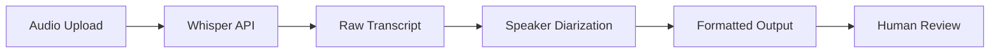
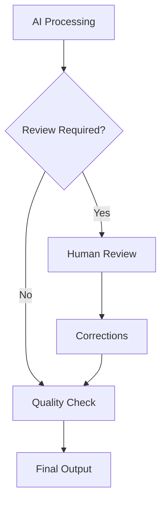

## AI Tool Categories

### Transcription Services
| Service | Strengths | Limitations | Cost |
|---------|-----------|-------------|------|
| Whisper API | High accuracy, multilingual | API setup required | $0.006/minute |
| AssemblyAI | Speaker diarization | US-based only | $0.015/minute |
| Rev AI | Fast processing | Limited languages | $0.025/minute |
| Deepgram | Real-time capable | Technical setup | $0.0125/minute |

### Content Processing
| Tool | Use Case | Key Features |
|------|----------|--------------|
| Claude | Story analysis, summarization | Context understanding |
| GPT-4 | Content generation, editing | Versatile processing |
| Gemini | Multimodal analysis | Image + text processing |
| Mistral | Efficient processing | Cost-effective |

### Specialized Tools
- **Grammarly**: Grammar and style checking
- **Hemingway**: Readability optimization
- **Copy.ai**: Marketing copy generation
- **Jasper**: Long-form content assistance

## Implementation Workflows

### Automated Transcription Pipeline


### API Configuration
```python
# Whisper API Setup
import openai

def transcribe_audio(file_path):
    with open(file_path, "rb") as audio_file:
        transcript = openai.Audio.transcribe(
            model="whisper-1",
            file=audio_file,
            response_format="json",
            language="en"
        )
    return transcript

# AssemblyAI Setup
import assemblyai as aai

def transcribe_with_speakers(file_url):
    config = aai.TranscriptionConfig(
        speaker_labels=True,
        speakers_expected=2
    )
    transcript = aai.Transcriber().transcribe(
        file_url,
        config=config
    )
    return transcript
```

## Story Processing Workflows

### 1. Initial Processing
```yaml
Input: Raw transcript
Process:
  - Remove filler words
  - Correct obvious errors
  - Format paragraphs
  - Identify speakers
Output: Clean transcript
```

### 2. Content Enhancement
```yaml
Input: Clean transcript
AI Tasks:
  - Extract key themes
  - Generate summary
  - Identify quotes
  - Suggest structure
Output: Enhanced document
```

### 3. Story Analysis
```yaml
Analysis Points:
  - Emotional tone
  - Key messages
  - Story arc
  - Impact elements
  - Target audience fit
```

## Prompt Engineering

### Transcription Cleaning
```markdown
Clean this transcript by:
1. Removing filler words (um, uh, like)
2. Fixing grammar while preserving voice
3. Creating paragraph breaks at natural pauses
4. Maintaining speaker labels
5. Preserving important context

Original transcript:
[INSERT TRANSCRIPT]
```

### Story Summarization
```markdown
Summarize this story in three formats:
1. One-sentence summary (tweet length)
2. One-paragraph summary (website feature)
3. Three key points (bullet format)

Focus on:
- Main challenge/situation
- Actions taken
- Outcome/impact

Story:
[INSERT STORY]
```

### Quote Extraction
```markdown
Extract 3-5 powerful quotes from this story that:
1. Stand alone without context
2. Capture the emotional core
3. Are 1-2 sentences maximum
4. Represent different story aspects

Story:
[INSERT STORY]
```

## Quality Assurance

### Accuracy Checks
1. **Fact Verification**
   - Cross-reference claims
   - Verify dates/numbers
   - Check name spellings

2. **Context Preservation**
   - Maintain speaker intent
   - Preserve cultural references
   - Keep technical accuracy

3. **Bias Detection**
   - Review AI suggestions
   - Check representation
   - Validate interpretations

### Human-in-the-Loop Process


## Integration Architecture

### API Management
```javascript
// Centralized API configuration
const AI_SERVICES = {
  transcription: {
    primary: 'whisper',
    fallback: 'assemblyai',
    settings: {
      language: 'en',
      model: 'whisper-1'
    }
  },
  processing: {
    primary: 'claude-3',
    fallback: 'gpt-4',
    settings: {
      temperature: 0.3,
      max_tokens: 2000
    }
  }
};
```

### Error Handling
```javascript
async function processWithFallback(content, service) {
  try {
    return await processContent(content, service.primary);
  } catch (error) {
    console.log(`Primary service failed: ${error}`);
    return await processContent(content, service.fallback);
  }
}
```

## Cost Optimization

### Usage Monitoring
| Metric | Target | Alert Threshold |
|--------|--------|-----------------|
| Monthly API calls | 10,000 | 8,000 |
| Average cost per story | $0.50 | $0.75 |
| Processing time | 5 min | 10 min |
| Error rate | <5% | >10% |

### Optimization Strategies
1. **Batch Processing**
   - Group similar requests
   - Use bulk endpoints
   - Schedule during off-peak

2. **Caching Results**
   - Store processed content
   - Reuse common analyses
   - Version control outputs

3. **Model Selection**
   - Use appropriate model sizes
   - Balance cost vs quality
   - Test cheaper alternatives

## Security Considerations

### Data Privacy
```yaml
Requirements:
  - API keys in environment variables
  - Encrypted data transmission
  - Temporary file deletion
  - No PII in logs
  - Regular access audits
```

### Compliance Checklist
- [ ] GDPR compliance for EU stories
- [ ] HIPAA compliance for health stories
- [ ] COPPA compliance for minor stories
- [ ] State privacy laws adherence
- [ ] Consent documentation

## Performance Metrics

### Quality Metrics
```markdown
## AI Performance Tracking

**Accuracy Metrics**
- Transcription accuracy: >95%
- Speaker identification: >90%
- Theme extraction: >85%

**Efficiency Metrics**
- Processing time: <5 minutes
- Cost per story: <$0.50
- Error rate: <5%

**Output Quality**
- Human edits required: <10%
- Readability score: >60
- Stakeholder satisfaction: >8/10
```

### Monthly Review Template
```markdown
## AI Usage Report - [Month Year]

**Volume**
- Stories processed: X
- Total API calls: X
- Processing hours: X

**Quality**
- Average accuracy: X%
- Error incidents: X
- Human corrections: X%

**Cost**
- Total spend: $X
- Cost per story: $X
- Budget variance: X%

**Improvements**
- [List optimizations made]
- [List planned improvements]
```

## Future Capabilities

### Emerging Technologies
1. **Voice Cloning**
   - Consent requirements
   - Use case evaluation
   - Ethical guidelines

2. **Real-time Translation**
   - Multi-language support
   - Cultural adaptation
   - Quality verification

3. **Sentiment Analysis**
   - Emotional mapping
   - Impact prediction
   - Audience resonance

### Evaluation Framework
- Technical feasibility
- Cost-benefit analysis
- Ethical implications
- User value assessment
- Implementation timeline