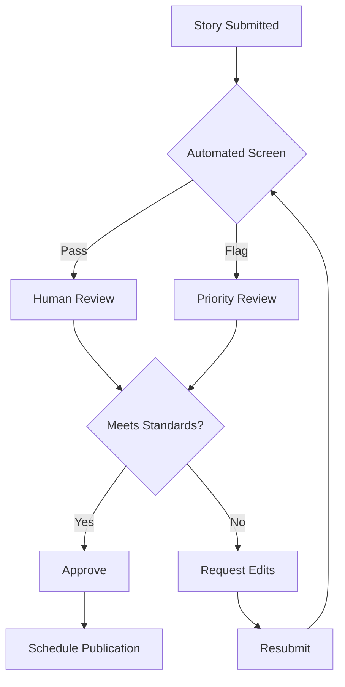

## Moderation Framework

### Review Stages
1. **Initial Screening**: Basic compliance check
2. **Content Review**: Detailed accuracy and appropriateness
3. **Legal Review**: Compliance and risk assessment
4. **Final Approval**: Leadership sign-off
5. **Post-Publication**: Ongoing monitoring

### Review Team Structure
```yaml
Roles:
  Content Screener:
    - Initial review
    - Fact checking
    - Flag concerns
    
  Senior Reviewer:
    - Complex cases
    - Policy decisions
    - Team guidance
    
  Legal Advisor:
    - Risk assessment
    - Compliance check
    - Documentation
    
  Final Approver:
    - Publication decision
    - Strategic alignment
    - Crisis management
```

## Screening Criteria

### Content Standards
| Category | Acceptable | Requires Review | Not Acceptable |
|----------|------------|-----------------|-----------------|
| Language | Professional, clear | Minor profanity | Hate speech, slurs |
| Accuracy | Verified facts | Unverified claims | False information |
| Privacy | Public information | Partial identifiers | Private details |
| Images | Licensed, appropriate | Unclear rights | Inappropriate content |
| Tone | Respectful, balanced | Strong opinions | Inflammatory |

### Automated Screening Tools
```python
# Content screening configuration
screening_rules = {
    "prohibited_terms": [
        # List maintained separately for security
    ],
    "flag_for_review": [
        "legal action",
        "lawsuit",
        "confidential",
        "internal only",
        "not for publication"
    ],
    "sensitivity_triggers": [
        "trauma",
        "violence",
        "medical details",
        "financial information"
    ]
}
```

## Review Processes

### Standard Review Workflow


### Review Checklist
```markdown
## Story Review Checklist

**Basic Requirements**
- [ ] Consent form signed
- [ ] Word count appropriate
- [ ] Formatting correct
- [ ] Attribution complete

**Content Standards**
- [ ] Factually accurate
- [ ] Appropriate tone
- [ ] No prohibited content
- [ ] Privacy protected

**Legal Compliance**
- [ ] No defamation risk
- [ ] No copyright issues
- [ ] GDPR compliant
- [ ] Industry regulations met

**Quality Standards**
- [ ] Clear narrative
- [ ] Proper grammar
- [ ] Engaging content
- [ ] Aligned with mission
```

## Sensitive Content Handling

### Content Categories
1. **Trauma/Violence**
   - Content warnings required
   - Additional review needed
   - Support resources included

2. **Medical Information**
   - HIPAA compliance check
   - Accuracy verification
   - Professional review

3. **Legal Matters**
   - Legal team review
   - Fact verification
   - Risk assessment

4. **Financial Information**
   - Numbers verification
   - Disclosure requirements
   - Privacy protection

### Moderation Guidelines
```yaml
Trauma Content:
  Requirements:
    - Content warning
    - Resource links
    - Supportive framing
  Review Level: Senior + Specialist
  
Medical Stories:
  Requirements:
    - Medical professional review
    - Disclaimer inclusion
    - Accuracy verification
  Review Level: Senior + Medical
  
Legal Stories:
  Requirements:
    - Legal review
    - Documentation
    - Insurance notification
  Review Level: Legal + Leadership
```

## Decision Framework

### Approval Matrix
| Content Type | Screener | Senior | Legal | Leadership |
|--------------|----------|---------|--------|------------|
| Standard story | Approve | - | - | - |
| Sensitive topic | Review | Approve | - | - |
| Legal implications | Review | Review | Approve | Notify |
| Crisis potential | Review | Review | Review | Approve |

### Escalation Triggers
```markdown
Immediate Escalation Required:
- Legal threats mentioned
- Harm to individuals
- Organizational risk
- Media attention likely
- Government involvement

24-Hour Escalation:
- Policy questions
- Precedent-setting
- Partner implications
- Significant edits needed
```

## Documentation Requirements

### Review Records
```yaml
Review Log Entry:
  story_id: [Unique ID]
  reviewer: [Name]
  date_reviewed: [Date]
  decision: [Approved/Rejected/Edits Required]
  notes: [Detailed comments]
  flags: [Any concerns]
  time_spent: [Minutes]
```

### Decision Documentation
1. **Approval Records**
   - Decision rationale
   - Conditions if any
   - Review participants
   - Date and time

2. **Rejection Records**
   - Specific concerns
   - Requested changes
   - Policy citations
   - Resubmission guidance

## Quality Assurance

### Accuracy Verification
```markdown
Fact-Checking Process:
1. Identify all claims
2. Verify primary sources
3. Cross-reference data
4. Document sources
5. Flag uncertainties

Tools:
- Google Scholar
- LexisNexis
- Industry databases
- Expert consultations
```

### Consistency Checks
- Style guide adherence
- Brand voice alignment
- Message consistency
- Format standards
- Technical accuracy

## Post-Publication Monitoring

### Monitoring Schedule
| Timeframe | Actions | Responsible |
|-----------|---------|-------------|
| 24 hours | Initial reaction check | Content team |
| 1 week | Engagement analysis | Analytics team |
| 1 month | Impact assessment | Strategy team |
| Ongoing | Issue monitoring | All teams |

### Response Protocols
```yaml
Positive Feedback:
  - Document impact
  - Share with storyteller
  - Amplify success
  
Corrections Needed:
  - Update immediately
  - Note correction
  - Notify stakeholders
  
Negative Reaction:
  - Assess validity
  - Prepare response
  - Monitor escalation
  - Document lessons
```

## Training and Development

### Reviewer Training
1. **Initial Training**
   - Platform overview
   - Policy deep dive
   - Practice reviews
   - Shadow experienced reviewer

2. **Ongoing Development**
   - Monthly case studies
   - Policy updates
   - Industry best practices
   - Cross-training

### Competency Framework
```markdown
Level 1 - Screener:
- Basic policy knowledge
- Standard cases only
- Clear documentation
- 95% accuracy target

Level 2 - Reviewer:
- Complex case handling
- Policy interpretation
- Team mentoring
- 98% accuracy target

Level 3 - Senior:
- Policy development
- Crisis management
- Strategic decisions
- Team leadership
```

## Performance Metrics

### Individual Metrics
- Reviews completed
- Accuracy rate
- Average review time
- Escalation rate
- Training compliance

### Team Metrics
```markdown
Monthly Dashboard:
- Total reviews: X
- Approval rate: X%
- Average turnaround: X hours
- Escalations: X
- Policy updates: X
- Training hours: X
```

## Technology Stack

### Moderation Tools
| Tool | Purpose | Integration |
|------|---------|-------------|
| Perspective API | Toxicity detection | Automated flagging |
| Grammarly Business | Grammar/style | Real-time checking |
| Copyscape | Plagiarism | Batch checking |
| Custom NLP | Sensitive content | API integration |

### Workflow Management
```yaml
Tool: Monday.com
Features:
  - Review queue management
  - SLA tracking
  - Team assignments
  - Audit trail
  - Reporting dashboard
  
Integration:
  - Slack notifications
  - Email alerts
  - API webhooks
  - Analytics export
```

## Continuous Improvement

### Feedback Loops
1. **Reviewer Feedback**
   - Monthly surveys
   - Process suggestions
   - Tool recommendations
   - Policy clarifications

2. **Stakeholder Input**
   - Quarterly reviews
   - Impact assessment
   - Strategic alignment
   - Resource planning

### Policy Evolution
- Quarterly policy review
- Industry benchmark analysis
- Legal landscape monitoring
- Technology assessment
- Team input integration