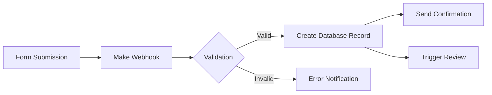
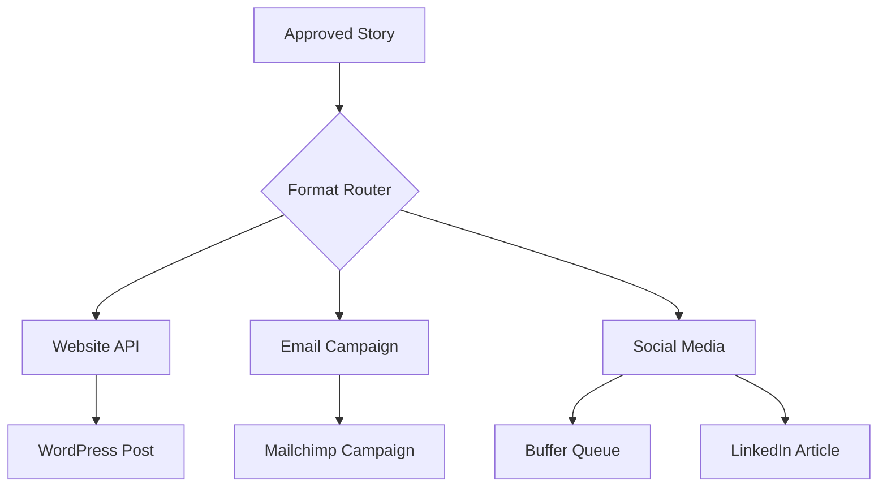

## Platform Overview

### Core Capabilities
- **Visual Workflow Builder**: Drag-and-drop interface
- **500+ Integrations**: Connect multiple services
- **Data Transformation**: Process and format content
- **Scheduling**: Automated triggers and timing
- **Error Handling**: Built-in retry and notification
- **Webhooks**: Real-time event processing

## Essential Workflows

### 1. Story Submission Pipeline


**Modules Used:**
- Webhooks: Receive form data
- Data Store: Temporary storage
- Airtable: Database creation
- Gmail: Notifications
- Slack: Team alerts

### 2. Transcription Automation
```yaml
Trigger: New audio file in Google Drive
Steps:
  1. Retrieve file metadata
  2. Send to Whisper API
  3. Store raw transcript
  4. Parse speaker labels
  5. Create Descript project
  6. Notify assigned editor
```

### 3. Content Distribution
```yaml
Trigger: Story marked as "Approved"
Steps:
  1. Generate social media versions
  2. Create email newsletter content
  3. Update website database
  4. Schedule social posts
  5. Track deployment status
```

## Detailed Workflow Builds

### Story Intake Automation

**Step 1: Webhook Setup**
```json
{
  "webhook_name": "story_submission",
  "data_structure": {
    "author_name": "string",
    "author_email": "email",
    "story_title": "string",
    "story_content": "text",
    "consent_given": "boolean",
    "submission_date": "datetime"
  }
}
```

**Step 2: Data Validation**
```javascript
// Make.com custom validation function
function validateSubmission(data) {
  const errors = [];
  
  if (!data.author_email || !data.author_email.includes('@')) {
    errors.push('Invalid email address');
  }
  
  if (!data.story_content || data.story_content.length < 100) {
    errors.push('Story too short (minimum 100 characters)');
  }
  
  if (!data.consent_given) {
    errors.push('Consent required');
  }
  
  return {
    valid: errors.length === 0,
    errors: errors
  };
}
```

**Step 3: Database Operations**
```yaml
Airtable Module Configuration:
  Base: Story Management
  Table: Submissions
  Action: Create Record
  Field Mapping:
    Title: {{story_title}}
    Content: {{story_content}}
    Author: {{author_name}}
    Email: {{author_email}}
    Status: "Pending Review"
    Submitted: {{submission_date}}
```

### Review Process Automation

**Workflow Structure:**
1. **Trigger**: Status change to "Ready for Review"
2. **Actions**:
   - Assign reviewer based on availability
   - Create review checklist
   - Set deadline (3 business days)
   - Send reviewer notification

**Implementation:**
```yaml
Scenario: Review Assignment
Modules:
  1. Watch Records (Airtable)
     Filter: Status = "Ready for Review"
  
  2. Get Reviewer (Custom API)
     Endpoint: /api/get-available-reviewer
     Method: POST
     Body: { category: "{{story_category}}" }
  
  3. Update Record (Airtable)
     Fields:
       Reviewer: {{reviewer_name}}
       Review_Deadline: {{addDays(now, 3)}}
       Status: "In Review"
  
  4. Send Email (Gmail)
     To: {{reviewer_email}}
     Subject: New Story for Review
     Body: Custom HTML template
```

### Multi-Platform Publishing

**Scenario: Cross-Platform Distribution**


**Configuration Details:**
```yaml
Website Publishing:
  Module: WordPress
  Action: Create Post
  Settings:
    Post Type: story
    Status: publish
    Categories: [stories, {{story_category}}]
    Custom Fields:
      author_name: {{author}}
      original_date: {{story_date}}
      consent_type: {{consent_level}}

Email Newsletter:
  Module: Mailchimp
  Action: Create Campaign
  Settings:
    List: Weekly Stories
    Template: story_feature
    Schedule: Next Tuesday 10am
    Segments: 
      - Engaged Subscribers
      - Story Category Interest

Social Media:
  Module: Buffer
  Action: Create Post
  Variants:
    Twitter:
      Text: {{truncate(story_summary, 250)}}
      Link: {{story_url}}
      Media: {{story_image}}
    LinkedIn:
      Text: {{story_excerpt}}
      Link: {{story_url}}
    Facebook:
      Text: {{story_summary}}
      Link: {{story_url}}
      Media: {{story_image}}
```

## Advanced Techniques

### Error Handling Patterns

**Retry Logic:**
```javascript
// Custom error handling module
const retryConfig = {
  maxAttempts: 3,
  backoffMultiplier: 2,
  initialDelay: 1000,
  
  shouldRetry: (error) => {
    const retryableCodes = [429, 500, 502, 503];
    return retryableCodes.includes(error.statusCode);
  }
};
```

**Notification System:**
```yaml
Error Router:
  Low Priority:
    - Send to error log
    - Daily summary email
  
  Medium Priority:
    - Slack notification
    - Error tracking system
  
  High Priority:
    - SMS to admin
    - Create incident ticket
    - Pause workflow
```

### Data Transformation

**Story Formatting:**
```javascript
// Transform story for different platforms
function formatStory(story, platform) {
  const formats = {
    website: {
      title: story.title,
      content: story.full_content,
      excerpt: truncate(story.content, 200),
      featured_image: story.image_url
    },
    email: {
      subject: `New Story: ${story.title}`,
      preheader: story.summary,
      body: addEmailTemplate(story.content),
      cta_url: story.permalink
    },
    social: {
      twitter: truncate(story.summary, 250) + ' ' + story.permalink,
      facebook: story.excerpt + '\n\nRead more: ' + story.permalink,
      linkedin: story.professional_summary + '\n\n' + story.permalink
    }
  };
  
  return formats[platform];
}
```

## Integration Recipes

### Google Workspace Integration
```yaml
Google Drive Monitor:
  Trigger: New file in folder
  Filter: File type = audio/video
  Actions:
    1. Get file details
    2. Move to processing folder
    3. Create tracking record
    4. Initiate transcription

Google Sheets Sync:
  Trigger: Every hour
  Source: Airtable stories
  Destination: Management dashboard
  Sync Fields:
    - Story ID
    - Title
    - Status
    - Metrics
```

### CRM Integration
```yaml
HubSpot Contact Enrichment:
  Trigger: New story author
  Actions:
    1. Search existing contacts
    2. Create/update contact
    3. Add to story authors list
    4. Tag with story topics
    5. Enroll in nurture sequence
```

## Performance Optimization

### Scenario Design Best Practices
1. **Minimize API Calls**
   - Batch operations when possible
   - Cache frequently used data
   - Use webhooks over polling

2. **Efficient Data Processing**
   - Filter early in the flow
   - Limit data transferred
   - Use native integrations

3. **Resource Management**
   - Monitor operation usage
   - Implement circuit breakers
   - Use scheduled scenarios wisely

### Monitoring Setup
```yaml
Monitoring Dashboard:
  Metrics:
    - Scenarios run: Daily/Weekly/Monthly
    - Error rate: By scenario and module
    - Processing time: Average and outliers
    - API usage: By service
    - Cost tracking: Operations consumed

Alerts:
    - Error rate > 5%
    - Processing time > 5 minutes
    - Failed scenarios > 3 consecutive
    - Monthly operations > 80% limit
```

## Troubleshooting Guide

### Common Issues
| Issue | Symptoms | Solution |
|-------|----------|----------|
| Webhook timeout | Incomplete data | Increase timeout, add retry |
| API rate limits | 429 errors | Implement backoff, use queue |
| Data formatting | Parse errors | Add validation, type checking |
| Memory limits | Scenario fails | Split large operations |

### Debug Techniques
1. **Enable Detailed Logging**
   - Turn on all module outputs
   - Check intermediate values
   - Export execution history

2. **Test with Sample Data**
   - Create test scenarios
   - Use static test data
   - Isolate problem modules

3. **Version Control**
   - Export scenario blueprints
   - Document changes
   - Maintain rollback versions

## Cost Management

### Operation Tracking
```markdown
## Monthly Operations Budget

**Allocation by Workflow:**
- Story Intake: 20% (2,000 ops)
- Transcription: 30% (3,000 ops)
- Distribution: 25% (2,500 ops)
- Analytics: 15% (1,500 ops)
- Reserve: 10% (1,000 ops)

**Optimization Targets:**
- Reduce polling frequency
- Implement smart triggers
- Batch similar operations
- Archive old scenarios
```

### Scaling Strategies
1. **Tiered Processing**
   - Priority queue for urgent stories
   - Batch processing for archives
   - Scheduled runs for reports

2. **External Processing**
   - Offload heavy computation
   - Use cloud functions
   - Implement hybrid workflows